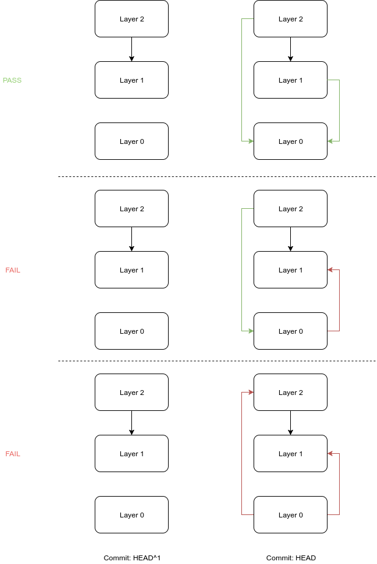

# acycliCode

  

**acycliCode** is a library for detecting Layering Violations as part of Continuous Integration (CI) checks projects with a C codebase. It is built on Python 3.x and [GNU Cflow](https://www.gnu.org/software/cflow/) and follows a differential approach of cycle detections keeping layers in disjoint sets. It uses this approach to prevent the problem of layering violations from happening.  It features checking for layering violations using Cflow static flow graph generator. It is released under the _MIT License_.


## Principle of Operation & Basic Concepts

Layered architectures were first proposed by Dijkstra and Parnas. They suggested the organization of the program modules into layers and establish a hierarchy between them such that modules can call functions from modules lying in adjoining layers. However, they did not devise systematic ways of analyzing such layered architectural schemata. There has been a research interest around layering violations in the recent years, since codebases have started becoming huge. 

Consider that you are starting a project and you want to adopt a layered architecture. Your aim is to have always modules that lie in their respective layers and do not violate the existing architecture as described above. You have decided the source code files are part each layer. For example consider a simple project with two files demo/foo.c and demo/boo.c: 

```json
{
	"demo/foo.c": 0, 
	"demo/boo.c": 1
}
```

This definition tells us that demo/foo.c lies in Layer 0 and demo/boo.c lies in Layer 1.

The contents of the files are: 

```c
// demo/foo.c
#include "boo.h"

int f(int x) {
	return g(x);
}
```

and

```c
// demo/boo.c
#include "foo.h"

int g(int x) {
	return x; 
}

int h(int x) {
	return f(x);  
}
```

Its obvious that there is a layering violation since f(x) calls g(x) and thus there's a call from Layer 0 to Layer 1.  That of course should not be allowed in a layered architecture. 

The **main idea** here is that _we can prevent this violation from happening via a failing test at the commit it caused it_. That is that for every commit h each and for every layer u and v each u -> v call must satisfy that `depth[u] >= depth[v]`.  It is therefore easy to show that if the edge set for `HEAD^1` contains no violations and the added function calls do not introduce any cycles then `HEAD` must contain no cycles. 

For example in a scheme with 3 layers (the colored edges correspond to the calls that were introduced in the current commit): 




The first of the three options depicted above is a valid option whereas the second and third options should not be allowed. This **differential approach** allows for **preventing the problem from happening**, and can be integrated to CI.

These edges can be generated using GNU Cflow via the command: 

```bash
cflow <changed-files> <direct-dependencies> -d 2 
```

Where `<changed-files>` correspond to the changed files and `<direct-dependencies>` correspond to the _direct includes_ of the changed files. The output of `cflow` is then parsed to detect cycles in a single iteration. 


## Installation

The project uses GNU Make for being installed. 

Configure everything: 

```bash
make
```

And install with:

```bash
sudo make install
```


## Usage

An example of usage is:

```bash
acyclicode -l layers.json --assert
```

which checks the last commit. It uses `layers.json` for the layer definition. 

Use the `acyclicode -h` with `-h` flag for more options. 


## Integration to CI 

You can add the following to `.travis.yml` configuration file for Travis CI: 

```yaml
language: c
compiler: gcc 

# Travis CI Related stuff
# ...
# End Travis CI Related stuff

# Install acycliCode
sudo: required

install:
  - git clone https://github.com/papachristoumarios/acycliCode
  - cd acycliCode && make && make install
  
script:
  - acyclicode --assert
```


## References

[1]  Sarkar, Santonu, Girish Maskeri Rama, and R. Shubha. "A method for detecting and measuring architectural layering violations in source code." *Software Engineering Conference, 2006. APSEC 2006. 13th Asia Pacific*. IEEE, 2006.


 
